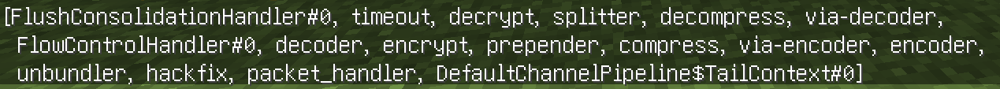

# 🔐 OfflineEncryptor
**A plugin that Enable vanilla Minecraft’s encryption handshake for offline-mode servers — without using Mojang authentication**

## What This Plugin Does

This plugin implements the **standard Minecraft encryption protocol (AES/CFB8 + RSA key exchange)** on servers running in **offline mode**.
Players still skip Mojang authentication, but the connection between client and server becomes encrypted exactly the same way as in **online-mode**.

In short:
🟢 **Offline players can join**
🟢 **Traffic becomes encrypted**
🔴 **No authentication / identity verification**

---

## Features

* Uses real **Minecraft 1.7+ encryption handshake**
* Protects traffic from sniffing
* Compatible with **AuthMe** and similar offline login plugins
* Does **not** require Mojang session servers
* Zero changes required for clients — works with any vanilla client

---

## ✅ Advantages

### ✔️ **Protects sensitive packets**

* Prevents attackers on the same network from reading:

    * Player chat messages
    * Commands (including `/login`, `/register`, AuthMe credentials)
    * Inventory interactions
    * Movement packet details
* Useful for LAN servers, VPN-shared servers, or hosts where you don’t fully trust the network path.

### ✔️ **Stops trivial MITM sniffing**

Encryption blocks attackers from:

* Sniffing passwords sent to AuthMe
* Quietly watching traffic in online cafés, dorms, shared Wi-Fi, cloud hosts, etc.

### ✔️ **Zero client modification**

Encryption uses the exact vanilla protocol, so players don’t need mods, plugins, or launchers.

### ✔️ **Drop-in for existing offline servers**

Just enable it — nothing need to change, no data will be modified (UUID, username, etc.)

---

## ⚠️ Limitations / Cons

### ❌ **No actual identity verification**

This plugin **does not make offline-mode secure against impersonation**.
Because the Mojang `joinServer` authentication step is skipped:

* Anyone can connect using **any username**, including impersonating staff.
* Encryption does **NOT** authenticate who the player really is.

You still need:

* AuthMe / LoginSecurity / similar
* IP / Geo / 2FA plugins if desired
* Proper permission handling

### ❌ **Does NOT stop MITM modification**

Encryption happens *after* the initial handshake.
A skilled attacker can still:

* MITM the first handshake packet
* Downgrade or strip encryption
* Impersonate a player before encryption is negotiated
  Unless players use a secure connection (VPN, SSH tunnel, etc.)

### ❌ **False sense of security if misunderstood**

Some admins may think:

> “We enabled encryption so offline mode is now secure.”
> This is **incorrect** — authentication and encryption are separate things.

### ❌ **Slight CPU overhead**

AES/CFB8 encryption is not heavy, but on very large servers the extra per-packet cost exists.

---

## ✔️ What It *Does* Secure

* Prevents sniffing of login passwords (AuthMe, etc.)
* Hides movement, chat, and gameplay packets
* Makes local/LAN attacks harder
* Restores privacy similar to online-mode encryption

## ❌ What It *Does NOT* Secure

* Offline-mode username spoofing
* Session stealing
* Man-in-the-middle manipulation before encryption begins
* Any kind of real authentication

---

## 📝 Summary

If you want **privacy** for an offline-mode server, this plugin helps.
If you want **security against impersonation**, you still need AuthMe (or similar) because **encryption ≠ authentication**.

This plugin is for:

* Server owners wanting encrypted traffic
* Offline/Cracked servers using AuthMe
* Hosts needing protection against local sniffers
* Privacy-conscious LAN/VPN servers

---

## Compatibility & Installation

###  Supported Versions

#### **Paper / Purpur / Leaves / Leaf / other Paper-downstreams**

* Version: 1.20.5+
* Install **if not using proxy like Velocity**.
* Running it on older versions will fail because encryption logic changed in 1.20.5.

#### **Velocity Proxy**

* Version: 3.4.0+
* Install the plugin **only on Velocity** if Velocity is present.
* **Do NOT install it on the backend server when using Velocity**, otherwise players will be unable to join.

#### Unsupported Server Types

* Spigot / CraftBukkit
* BungeeCord / Waterfall
* Any server < 1.20.5

---

### Client Requirements

* **Requires Minecraft client 1.20.5 or newer**: Mojang changed the handshake and encryption flow in 1.20.5; older clients cannot complete the encryption sequence. This plugin **will not** send encrypted request packet to players with older versions.

---

### ViaVersion Compatibility

The plugin is **fully compatible** with the entire Via series:

* [ViaVersion](https://github.com/ViaVersion/ViaVersion)
* [ViaBackwards](https://github.com/ViaVersion/ViaBackwards)
* [ViaRewind](https://github.com/ViaVersion/ViaRewind)

ViaVersion can down-translate gameplay packets, but **encryption still requires the real client version to be 1.20.5+**.

---

### Netty pipeline after installed this plugin with [ViaVersion](https://github.com/ViaVersion/ViaVersion).
